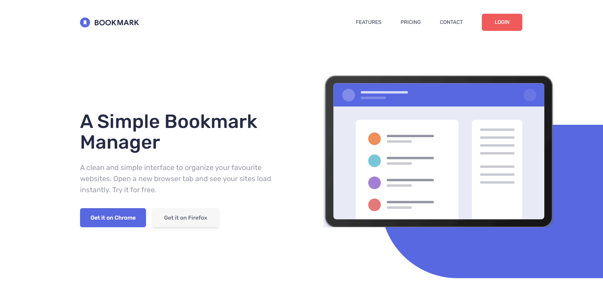

# Frontend Mentor - Bookmark landing page solution

This is a solution to the [Bookmark landing page challenge on Frontend Mentor](https://www.frontendmentor.io/challenges/bookmark-landing-page-5d0b588a9edda32581d29158).

## Table of contents

- [Overview](#overview)
  - [The challenge](#the-challenge)
  - [Screenshot](#screenshot)
  - [Links](#links)
- [My process](#my-process)
  - [Built with](#built-with)
  - [What I learned](#what-i-learned)
  - [Useful resources](#useful-resources)
- [Author](#author)


## Overview

### The challenge

Users can:

- View the optimal layout for the site depending on their device's screen size
- See hover states for all interactive elements on the page
- Receive an error message when the newsletter form is submitted if:
  - The input field is empty
  - The email address is not formatted correctly

### Screenshot



### Links

- Solution URL: [Solution on Frontend mentor](https://github.com/David-Henery4/Bookmark-Landing)
- Live Site URL: [Bookmarks Landing](https://bookmarks-home-landing.netlify.app)

## My process

### Built with

- Semantic HTML5 markup
- Flexbox
- CSS Grid
- Mobile-first workflow
- [TailwindCSS](https://reactjs.org/) - CSS Utillity class library

### What I learned

This is the third project I have built using tailwind and with each project, I feel I'm becoming a lot more comfortable with it and find that it's gradually increasing the speed of my css workflow. With time, I feel this will be incredibly usefull, especially when used on larger projects.

I know I'm only just scratching the surface with tailwind and with every project I am discovering new things.
In this project I discovered and used two new things I can use in tailwind.

First new feature I found and used is how to use the "@apply" directive to create different component classess in tailwind. This comes in really handy when you have to repeat multiple utillity class combinations to create different components. For Example, when you have to use 5 to 6 ultillity classes to create a button or card that is then reused thoughout your project, you can place these classes into a custom class using the "@apply" directive. Then when you need to use these classes you only have to reference the custom class where you need to, rather than reusing all those utillity classes everytime. This speeds up the overall workflow because it saves you a lot of time that you would have used repeating the component class names multiple times.

Another feature of tailwind I first learned and used in this project was how to add arbitrary values to our classes. Being able to add arbitrary values is a very good feature I will definitly be using in future projects. Arbitrary values allows us to add custom units to our classes without having to add these units directly to our theme in the tailwind config. This is especially useful when we need to only use a custom unit (like 47px to the padding etc) in only one or two places thoughout our project and it really doesn't need to be added to the overall theme file.


### Arbitrary Values example
```html
<!-- Here is the background shapes I created using an empty div. Here is where I used some artbitrary values -->
<div class="hidden absolute bg-softBlue rounded-[316px] w-[200%] h-full -z-10 smLap:right-[64%] smLap:top-[24%] smLap:block"></div>
```

### Combined Utillities example

```css
/* Here I created a component class to combine multiple utillity classes into one (We put this in the input file we place the tailwind imports) */
@tailwind base;
@tailwind components;
@tailwind utilities;

@layer components {
  /* Combining multiple classes into one */
  .card-upper{
    @apply px-7 pb-8 pt-12 h-7/9 flex flex-col items-center justify-between
  }
}
```

### Useful resources

- [TailwindCSS Documentation](https://www.example.com) - The TailwindCSS documentation has been my go to resource.


## Author

- Website - [David Henery](https://www.djhwebdevelopment.com)
- Frontend Mentor - [@David-Henery4](https://www.frontendmentor.io/profile/David-Henery4)
- linkedIn - [David Henery](https://www.linkedin.com/in/david-henery-725458241)

